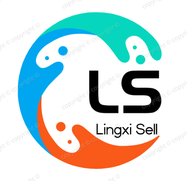

<p align="center" >
<span style="background-color: #5373e0;display: inline-block"> 

</span>
</p>
<h1 align="center" style="margin: 30px 0 30px; font-weight: bold;">灵犀</h1>
<h4 align="center">基于RuoYi（SpringBoot+Vue前后端分离）的Java快速开发框架</h4>


## 背景介绍

灵犀智能零售终端管理系统是基于 RuoYi 框架开发的一款前后端分离的智能零售管理平台，采用 SpringBoot + Vue 3 + Element Plus + Vite 技术栈。该系统旨在提升传统售货机的运营、运维效率，通过运营数据的采集和分析不断优化运营方案，降低运营、运维成本，缩短B端用户的盈利周期。

系统通过物联网技术实现对售货机设备的远程监控和管理，支持多种业务模式，包括自营模式、加盟模式和点位主分成模式等。针对不同的摆放点位及商业场景，可匹配不同机型及不同的商品，供B端用户贴合自身特点来快速实现商业价值。

## 技术架构

### 前端技术栈
- **框架**: Vue 3
- **构建工具**: Vite 5.0.4
- **UI组件库**: Element Plus 2.4.3
- **状态管理**: Pinia 2.1.7
- **路由**: Vue Router 4.2.5
- **HTTP客户端**: Axios 0.27.2
- **图表库**: ECharts 5.4.3
- **日期处理**: Dayjs 1.11.11
- **样式预处理器**: Sass 1.69.5

### 后端技术栈
- **框架**: Spring Boot
- **持久层**: MyBatis Plus
- **数据库**: MySQL
- **缓存**: Redis
- **安全**: Spring Security
- **API文档**: Swagger

### 依赖关系
- 前端依赖: 详见 `package.json` 文件
- 后端依赖: 详见各模块的 `pom.xml` 文件

## 核心功能模块详细说明

### 1. 平台管理端
平台管理端是系统的核心管理模块，主要功能包括：

#### 1.1 设备管理
- **主要作用**: 管理售货机设备的全生命周期
- **实现方式**: 基于 Vue 组件和 Spring Boot 后端API
- **技术特点**: 支持设备状态实时监控、货道配置、设备分组管理
- **核心功能**:
  - 设备基础信息管理（增删改查）
  - 设备状态监控与预警
  - 货道配置与商品关联
  - 设备分组与区域管理

#### 1.2 商品管理
- **主要作用**: 管理商品信息和库存
- **实现方式**: 基于 Element Plus 表格和表单组件
- **技术特点**: 支持商品分类管理、库存预警
- **核心功能**:
  - 商品分类管理
  - 商品信息管理（名称、价格、库存等）
  - 商品图片上传与管理
  - 库存监控与预警

#### 1.3 工单管理
- **主要作用**: 管理设备维修和运营工单
- **实现方式**: 基于 Vue 组件和状态管理
- **技术特点**: 支持工单状态跟踪、指派和处理
- **核心功能**:
  - 维修工单管理（创建、分配、处理、完成）
  - 运营工单管理（补货、清洁等）
  - 工单状态跟踪与通知
  - 工单统计与分析

#### 1.4 订单管理
- **主要作用**: 管理销售订单和交易记录
- **实现方式**: 基于 Element Plus 表格和 ECharts 图表
- **技术特点**: 支持订单统计、销售额分析
- **核心功能**:
  - 订单列表查询与筛选
  - 订单详情查看
  - 销售数据统计与分析
  - 订单状态管理

#### 1.5 合作商管理
- **主要作用**: 管理合作商信息和权限
- **实现方式**: 基于 Vue 组件和 Spring Security
- **技术特点**: 支持合作商权限管理和数据隔离
- **核心功能**:
  - 合作商信息管理
  - 合作商权限分配
  - 合作商数据统计
  - 合作商结算管理

#### 1.6 区域管理
- **主要作用**: 管理设备点位的区域划分
- **实现方式**: 基于 Vue 组件和树形结构
- **技术特点**: 支持多级区域划分和管理
- **核心功能**:
  - 区域层级管理
  - 区域设备统计
  - 区域负责人分配

#### 1.7 策略管理
- **主要作用**: 配置设备运营策略
- **实现方式**: 基于 Vue 表单和后端API
- **技术特点**: 支持灵活的策略配置和应用
- **核心功能**:
  - 促销策略配置
  - 价格策略配置
  - 库存策略配置
  - 策略应用与管理

#### 1.8 AI对话功能
- **主要作用**: 提供智能对话和数据分析能力
- **实现方式**: 基于 Vue 组件和大语言模型API
- **技术特点**: 支持上下文对话、智能分析和建议
- **核心功能**:
  - 智能客服问答
  - 运营数据分析
  - 智能运营建议
  - 对话历史管理

#### 1.9 商品购物功能
- **主要作用**: 实现用户选择售货机进行商品购买
- **实现方式**: 基于 Vue 组件和后端API
- **技术特点**: 支持售货机选择、商品浏览、购物车管理和支付流程优化
- **核心功能**:
  - 售货机选择与切换
  - 商品浏览与详情查看
  - 购物车管理（添加、修改、删除商品）
  - 快速支付流程
  - 订单自动生成


### 2. AI功能
系统集成了AI聊天功能，支持与大语言模型进行交互，主要用于：

#### 2.1 智能客服
- **主要作用**: 解答用户疑问和提供帮助
- **实现方式**: 基于 Vue 组件和大语言模型API
- **技术特点**: 支持上下文对话和智能回复
- **核心功能**:
  - 智能问答
  - 常见问题解答
  - 系统操作指导

#### 2.2 数据分析
- **主要作用**: 辅助运营数据分析
- **实现方式**: 基于 ECharts 和大语言模型API
- **技术特点**: 支持数据可视化和智能分析
- **核心功能**:
  - 销售数据分析
  - 设备状态分析
  - 工单处理分析
  - 趋势预测

#### 2.3 智能建议
- **主要作用**: 基于数据提供运营建议
- **实现方式**: 基于大语言模型API和后端数据
- **技术特点**: 支持个性化建议和优化方案
- **核心功能**:
  - 商品推荐
  - 促销策略建议
  - 库存优化建议
  - 设备维护建议

### 3. 工具管理
工具管理模块提供了开发和维护工具，主要包括：

#### 3.1 代码生成 
- **主要作用**: 自动生成前后端代码
- **实现方式**: 基于 Vue 组件和模板引擎
- **技术特点**: 支持快速开发和代码标准化
- **核心功能**:
  - 数据库表结构分析
  - 前后端代码自动生成
  - 代码模板管理

#### 3.2 构建工具
- **主要作用**: 可视化构建页面组件
- **实现方式**: 基于 Vue 组件和拖拽功能
- **技术特点**: 支持可视化设计和代码生成
- **核心功能**:
  - 页面组件拖拽设计
  - 组件属性配置
  - 代码自动生成

#### 3.3 Swagger文档
- **主要作用**: 生成和管理API接口文档
- **实现方式**: 基于 Swagger 和 Vue 组件
- **技术特点**: 支持API接口可视化和测试
- **核心功能**:
  - API接口文档生成
  - 接口测试
  - 接口版本管理

### 4. 权限管理
系统采用基于角色的权限控制，根据用户角色提供不同的功能权限：

#### 4.1 运维人员
- **核心权限**:
  - 设备故障处理
  - 维修工单管理
  - 设备状态监控
  - 设备维护记录

#### 4.2 运营人员
- **核心权限**:
  - 商品管理
  - 订单管理
  - 运营工单管理
  - 销售数据分析

#### 4.3 管理员
- **核心权限**:
  - 系统全部功能权限
  - 用户和权限管理
  - 系统配置和管理
  - 数据备份和恢复

## 关键功能使用流程

### 1. 设备管理流程
1. **设备注册**:
   - 进入设备管理页面
   - 点击"新增"按钮
   - 填写设备基本信息（设备编号、型号、位置等）
   - 保存设备信息

2. **设备配置**:
   - 选择设备点击"货道配置"
   - 配置货道与商品的对应关系
   - 设置货道容量和当前库存
   - 保存配置信息

3. **设备监控**:
   - 进入设备监控页面
   - 查看设备实时状态
   - 处理设备异常告警
   - 查看设备历史状态

### 2. 商品管理流程
1. **商品分类创建**:
   - 进入商品分类管理页面
   - 点击"新增"按钮
   - 填写分类信息
   - 保存分类

2. **商品添加**:
   - 进入商品管理页面
   - 点击"新增"按钮
   - 填写商品信息（名称、价格、分类等）
   - 上传商品图片
   - 保存商品信息

3. **库存管理**:
   - 进入商品管理页面
   - 查看商品库存状态
   - 点击"编辑"按钮调整库存
   - 保存库存信息

### 3. 工单管理流程
1. **工单创建**:
   - 进入工单管理页面
   - 点击"新增"按钮
   - 选择工单类型（维修/运营）
   - 填写工单详情
   - 保存工单

2. **工单处理**:
   - 选择待处理工单
   - 点击"处理"按钮
   - 填写处理详情
   - 更新工单状态
   - 提交处理结果

3. **工单跟踪**:
   - 进入工单管理页面
   - 查看工单状态和处理进度
   - 点击"详情"按钮查看工单详情
   - 跟踪工单处理情况

### 4. 订单管理流程
1. **订单查询**:
   - 进入订单管理页面
   - 设置查询条件（时间范围、订单状态等）
   - 点击"搜索"按钮
   - 查看订单列表

2. **订单详情**:
   - 选择订单点击"查看详情"
   - 查看订单详细信息
   - 查看支付和出货状态
   - 处理异常订单

3. **销售分析**:
   - 进入销售统计页面
   - 设置统计时间范围
   - 查看销售数据图表
   - 分析销售趋势

### 5. AI功能使用流程
1. **智能聊天**:
   - 进入AI聊天页面
   - 输入问题或需求
   - 等待AI回复
   - 继续与AI交互

2. **数据分析**:
   - 进入AI分析页面
   - 选择分析类型
   - 设置分析参数
   - 查看AI分析结果

3. **智能建议**:
   - 进入AI建议页面
   - 选择建议类型
   - 查看AI生成的建议
   - 应用建议到系统

### 6. 商品购物功能使用流程
1. **售货机选择**:
   - 进入商品购物页面
   - 从下拉列表中选择售货机
   - 系统自动加载所选售货机的商品信息

2. **商品浏览与添加**:
   - 浏览商品列表
   - 点击商品卡片将商品添加到购物车
   - 查看购物车中的商品和数量

3. **购物车管理**:
   - 调整商品数量（增加/减少）
   - 删除不需要的商品
   - 查看购物车总价

4. **快速支付**:
   - 点击"结算"按钮
   - 系统自动处理支付流程
   - 支付成功后显示支付成功提示
   - 系统自动生成订单记录

## 环境配置要求

### 前端环境
- **Node.js**: 14.18.0 或更高版本
- **npm**: 6.14.15 或更高版本
- **浏览器**: Chrome 90+、Firefox 88+、Safari 14+、Edge 90+

### 后端环境
- **Java**: JDK 1.8 或更高版本
- **Maven**: 3.6.0 或更高版本
- **MySQL**: 5.7 或更高版本
- **Redis**: 6.0 或更高版本
- **Spring Boot**: 2.5.15

### 开发环境配置
1. **前端配置**:
   ```bash
   # 安装依赖
   npm install
   
   # 启动开发服务器
   npm run dev
   
   # 构建生产版本
   npm run build:prod
   ```

2. **后端配置**:
   - 配置 `application.yml` 文件中的数据库连接信息
   - 配置 Redis 连接信息
   - 设置 `AIVIDEO_CONFIG_ENCRYPTION_KEY`，值为 Base64 编码的 32 字节随机密钥；生产环境必须固定保存，变更后已加密的 API Key 将无法解密
   - 启动后使用“AI 模型配置”页面保存 Workspace、API Key 和模型名称，后端配置文件不再提供模型参数兜底

## 已知限制与待优化点

### 已知限制
1. **性能限制**:
   - 大规模设备管理时可能出现性能瓶颈
   - 实时数据处理能力有限

2. **功能限制**:
   - AI功能依赖外部大语言模型API
   - 部分高级分析功能需要额外配置

3. **兼容性限制**:
   - 前端部分功能在低版本浏览器中可能存在兼容性问题
   - 后端系统对数据库版本有一定要求

### 待优化点
1. **性能优化**:
   - 优化数据库查询性能
   - 实现数据缓存机制
   - 优化前端渲染性能

2. **功能优化**:
   - 增强AI功能的本地化支持
   - 完善数据分析和预测能力
   - 提升系统安全性

3. **用户体验优化**:
   - 改进移动端适配
   - 优化操作流程
   - 增强系统响应速度

4. **扩展性优化**:
   - 模块化设计改进
   - 插件系统开发
   - API接口标准化

## 示例代码

### 前端API调用示例
```javascript
// 设备管理API调用示例
import { getVendingMachines, getChannelsByVmId } from '@/api/manage/vm';

// 获取售货机列表
const loadVendingMachines = async () => {
  try {
    const res = await getVendingMachines();
    vendingMachines.value = res.data || [];
  } catch (error) {
    console.error('加载售货机列表失败:', error);
  }
};

// 获取货道信息
const loadChannels = async (vmId) => {
  try {
    const res = await getChannelsByVmId(vmId);
    channels.value = res.data || [];
  } catch (error) {
    console.error('加载货道信息失败:', error);
  }
};
```

### 后端Controller示例
```java
// 设备管理Controller示例
@Api(tags = "设备管理")
@RestController
@RequestMapping("/manage/vm")
public class VendingMachineController extends BaseController {
    
    @Autowired
    private IVendingMachineService vendingMachineService;
    
    @ApiOperation("查询设备管理列表")
    @PreAuthorize("@ss.hasPermi('manage:vm:list')")
    @GetMapping("/list")
    public TableDataInfo list(VendingMachine vendingMachine) {
        startPage();
        List<VendingMachine> list = vendingMachineService.selectVendingMachineList(vendingMachine);
        return getDataTable(list);
    }
    
    // 其他方法...
}
```

## 项目结构

### 前端项目结构
```
src/
├── api/            # API接口定义
├── assets/         # 静态资源
├── components/     # 通用组件
├── directive/      # 自定义指令
├── layout/         # 布局组件
├── plugins/        # 插件
├── router/         # 路由配置
├── store/          # 状态管理
├── utils/          # 工具函数
├── views/          # 页面视图
├── App.vue         # 应用入口
├── main.js         # 主入口
├── permission.js   # 权限管理
└── settings.js     # 系统设置
```

### 后端项目结构
```
lingXi-parent/
├── lingXi-admin/      # 管理后台
├── lingXi-common/     # 通用模块
├── lingXi-framework/  # 框架模块
├── lingXi-generator/  # 代码生成器
├── lingXi-manage/     # 业务管理模块
└── lingXi-quartz/     # 定时任务模块
```

## 总结

灵犀智能零售终端管理系统是一款功能完善、技术先进的智能零售管理平台，通过前后端分离架构和现代化技术栈，实现了对售货机设备的全面管理和运营优化。系统不仅提供了基础的设备管理、商品管理、订单管理等功能，还集成了AI功能，为用户提供智能分析和建议。

系统采用模块化设计，具有良好的扩展性和可维护性，能够满足不同规模和业务场景的需求。通过持续的优化和迭代，系统将不断提升用户体验和功能完整性，为智能零售行业的发展提供有力支持。
