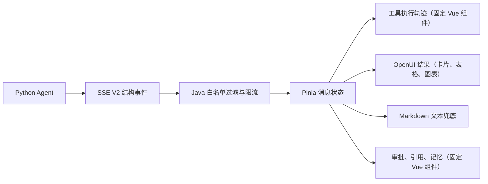

可以。建议采用“**固定系统组件 + OpenUI 生成式结果 + Markdown 兜底**”的三层方案，不直接把所有内容交给 OpenUI。这样既能提升工具调用样式，也不会破坏现有审批和安全边界。

## 一、目标架构



职责划分：

- 工具执行状态、审批、安全提示：前端固定组件，模型不能改变其行为。
- 查询结果、数据看板、设备卡片：OpenUI 动态生成。
- 普通解释、代码、长文本：继续使用 Markdown。
- OpenUI 解析或渲染失败：自动降级为 Markdown。

## 二、工具调用界面

当前工具轨迹位于 [qwen-chat.vue](D:/code/lingXi-parent/lingXi-vue/src/views/ai/qwen-chat.vue:140)，样式位于同文件 [2712 行](D:/code/lingXi-parent/lingXi-vue/src/views/ai/qwen-chat.vue:2712)。

建议改为 `AgentExecutionTrace`：

```text
✓ 已完成 3 个步骤 · 2.4 秒                         展开

  ✓ 查询销售汇总
    2026-08-01 至 2026-08-11 · 返回 12 项       860 ms

  ✓ 查询异常设备
    华东区域 · 返回 3 项                         420 ms

  ◌ 正在整理分析结果
```

交互规则：

- 执行中自动展开，展示当前步骤。
- 全部成功后自动折叠，只保留摘要。
- 失败或等待确认时保持展开。
- 用户可手动展开，查看每一步的安全参数摘要。
- 同一工具调用多次时分别展示，不能合并。
- 运行中只使用轻量状态动画，完成后不持续闪动。
- 手机端耗时、数量移动到第二行，避免横向拥挤。
- 支持键盘展开、清晰焦点环和 `prefers-reduced-motion`。

视觉规范：

- 主色继续使用当前青绿色，但只强调进行中状态。
- 面板使用中性浅灰绿色，不再使用醒目的整块绿色背景和左侧粗色条。
- 成功、警告、失败颜色只用于状态图标与关键文字。
- 数量、耗时使用等宽数字。
- 动画控制在 160–220ms，使用 `transform` 和 `opacity`。

## 三、解决现有数据结构问题

当前 [aiChat.js](D:/code/lingXi-parent/lingXi-vue/src/store/modules/aiChat.js:20) 按工具名称查找活动，且模板使用 `activity.tool` 作为 key。相同工具调用两次会被合并。

需要新增唯一的 `call_id`：

| 事件 | 关键字段 | 前端处理 |
|---|---|---|
| `tool_start` | `call_id`、`sequence`、`tool`、`input_summary` | 新增执行步骤 |
| `tool_progress` | `call_id`、`status`、`result_count` | 更新进度 |
| `tool_end` | `call_id`、`status`、`elapsed_ms`、`result_count` | 完成步骤 |
| `ui_start` | `render_id`、`schema_version` | 创建 OpenUI 缓冲区 |
| `ui_delta` | `render_id`、`sequence`、`delta` | 流式更新界面 |
| `ui_complete` | `render_id`、`spec`、`fallback_markdown` | 校验并渲染 |
| `ui_error` | `render_id`、`code` | 降级为 Markdown |

推荐的前端步骤结构：

```js
{
  callId,
  sequence,
  tool,
  label,
  status,
  inputSummary,
  resultCount,
  startedAt,
  endedAt,
  elapsedMs,
  errorCode,
  retryable
}
```

`inputSummary` 只能包含日期范围、区域、设备编号等白名单字段，不能包含令牌、内部 URL 或原始工具参数。

## 四、前端组件拆分

把目前超过 3000 行的聊天页面逐步拆分：

```text
src/views/ai/components/
├── AssistantMessage.vue
├── AgentExecutionTrace.vue
├── AgentToolStep.vue
├── AgentApprovalCard.vue
├── AgentCitationList.vue
├── AgentMemoryNote.vue
├── OpenUIRenderer.vue
└── openui/
    ├── MetricGrid.vue
    ├── MetricCard.vue
    ├── DataTable.vue
    ├── ChartRenderer.vue
    ├── DeviceStatusCard.vue
    ├── MaintenanceTaskCard.vue
    └── MediaResult.vue
```

首批 OpenUI 组件白名单：

- `Text`、`Markdown`
- `Notice`
- `MetricGrid`、`MetricCard`
- `DataTable`
- `LineChart`、`BarChart`、`PieChart`
- `DeviceStatusCard`
- `MaintenanceTaskCard`
- `ImageResult`、`VideoResult`

只允许模型组合这些组件，不允许：

- 任意 HTML 或 JavaScript
- 动态导入组件
- 自定义 API 地址
- 任意点击事件
- 未经审批的写操作
- 非白名单图片和跳转协议

项目是 Vue 3 + Element Plus。优先验证 OpenUI 的 Vue 社区渲染方案；如果成熟度不足，就保留 OpenUI Lang/协议，自建一个小型 Vue 组件映射层。没有必要为了 OpenUI 引入完整 React 运行时。

## 五、审批、引用和记忆

审批卡片位于 [qwen-chat.vue](D:/code/lingXi-parent/lingXi-vue/src/views/ai/qwen-chat.vue:155)，必须继续作为固定组件：

- OpenUI 只能展示查询结果，不能直接创建工单。
- 写操作仍由 `approval_required` 返回服务端 `action_id`。
- “批准并创建”继续调用现有审批恢复接口。
- 展示目标设备、影响范围、实际写入内容。
- 操作完成后显示真实工单编号。
- 拒绝后明确显示“未执行任何写操作”。

引用建议由绿色标签改为编号式参考资料：

```text
参考资料  3

[1] 补货规范 · 完成工单
[2] 设备异常处理手册 · E01
```

记忆保存提示降低视觉优先级，作为回复底部的一行状态提示，不使用大面积成功色。

## 六、后端改造

### Python Agent

修改：

- [chat.py](D:/code/lingXi-parent/lingXi-agent/app/api/v1/chat.py:1031)
- [response.py](D:/code/lingXi-parent/lingXi-agent/app/schemas/response.py)

工作内容：

- `StreamEvent` 增加 OpenUI 事件类型。
- 从 LangChain `tool_call.id` 和 `ToolMessage.tool_call_id` 提取 `call_id`。
- 记录工具开始时间和耗时。
- 生成安全的 `input_summary`。
- 增加 OpenUI 表现层节点。
- 输出前执行 schema、节点数量、深度和字段长度校验。
- OpenUI 失败时生成 `fallback_markdown`。
- 保持现有 `token`、`done`、审批和记忆事件兼容。

第一版只在“数据分析”模式启用 OpenUI，普通聊天保持原行为。

### Java 中间层

修改 [AgentClient.java](D:/code/lingXi-parent/dkd-parent/lingXi-manage/src/main/java/com/lingXi/ai/client/AgentClient.java:1376)：

- 白名单增加 `ui_start`、`ui_delta`、`ui_complete`、`ui_error`。
- 转发 `call_id`、`sequence`、`elapsed_ms` 和安全参数摘要。
- 对 OpenUI payload 设置大小、深度和节点数限制。
- 丢弃未知事件和未知字段。
- 禁止工具原始输出、令牌和内部 URL 穿透 Java 边界。

建议限制：

- 单条 UI Spec 不超过 256KB
- 最大节点数 120
- 最大嵌套深度 8
- 单个文本属性不超过 4KB
- 外部 URL 必须经过协议和域名校验

### 数据库存储

当前 [ModelHistory.java](D:/code/lingXi-parent/dkd-parent/lingXi-manage/src/main/java/com/lingXi/manage/domain/ModelHistory.java:35) 只保存文本，无法在刷新后恢复工具轨迹和 OpenUI。

建议新增 `tb_model_message_artifact`：

- `message_id`
- `artifact_type`：`OPENUI`、`TOOL_TRACE`、`CITATIONS`、`ACTION`
- `schema_version`
- `payload_json`
- `display_order`
- `status`
- `created_at`、`updated_at`

原 `content` 字段继续保存 Markdown 兜底文本，旧消息完全兼容。历史接口增加 `artifacts` 数组，页面刷新后可以恢复完整界面。

## 七、安全补强

当前 Markdown 通过 `marked.parse()` 后使用 `v-html`：[qwen-chat.vue](D:/code/lingXi-parent/lingXi-vue/src/views/ai/qwen-chat.vue:869)。保留 Markdown 时需要增加 HTML 清洗：

- 使用 DOMPurify 或严格自定义 Renderer。
- 仅开放必要的图片、视频和格式化标签。
- 删除脚本、内联事件、危险协议和未知属性。
- OpenUI 不经过 `v-html`，只能渲染 Vue 白名单组件。
- 所有写操作继续由 Java 权限和审批链最终控制。

## 八、测试方案

前端：

- 相同工具连续调用不会合并。
- 事件重复、乱序时不会产生重复步骤。
- 切换会话后仍能接回流式状态。
- 完成自动折叠，失败保持展开。
- OpenUI 无效时自动回退 Markdown。
- 手机、键盘操作、减少动画模式正常。

Python：

- `call_id` 能正确对应开始和结束事件。
- 非白名单参数不会进入 SSE。
- OpenUI 超深、超长、未知组件被拒绝。
- UI 失败仍返回可读文本。
- 审批中断和恢复不生成重复消息。

Java：

- 新事件能够通过，未知事件被丢弃。
- 大 payload、危险 URL 和敏感字段被拒绝。
- 工具令牌、用户身份字段不会发往浏览器。
- 文本持久化与 artifact 持久化保持同一终态。

## 九、实施顺序

1. **工具轨迹视觉重构：1–2 天**  
   拆分 Vue 组件、加入折叠时间线、状态样式，不改后端协议。

2. **事件协议增强：2–3 天**  
   增加 `call_id`、耗时、安全参数摘要，完善 Python、Java 和 Pinia。

3. **OpenUI 数据分析试点：3–5 天**  
   实现指标卡、表格、ECharts 图表和 Markdown 降级。

4. **历史持久化与灰度：3–5 天**  
   增加 artifact 表、历史回放、功能开关、监控和兼容测试。

单人完整实施预计约 **10–15 个开发日**。建议通过 `toolTraceV2` 和 `openUIEnabled` 两个独立开关灰度上线，任何异常都可以立即切回当前 Markdown 渲染。

最终效果是：工具调用过程更清晰但不抢正文，业务结果能生成真正的卡片、表格和图表，审批仍由可信固定界面控制，旧消息和旧客户端保持兼容。