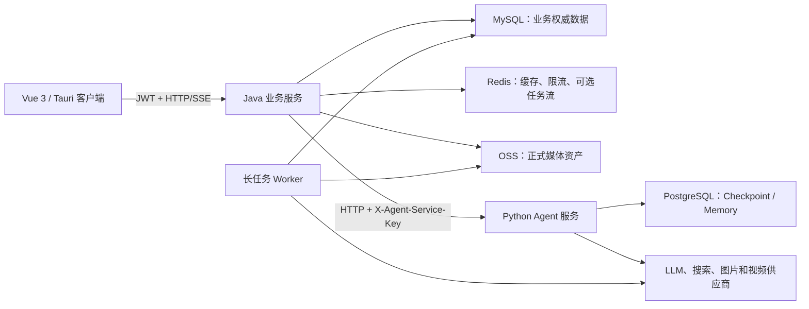
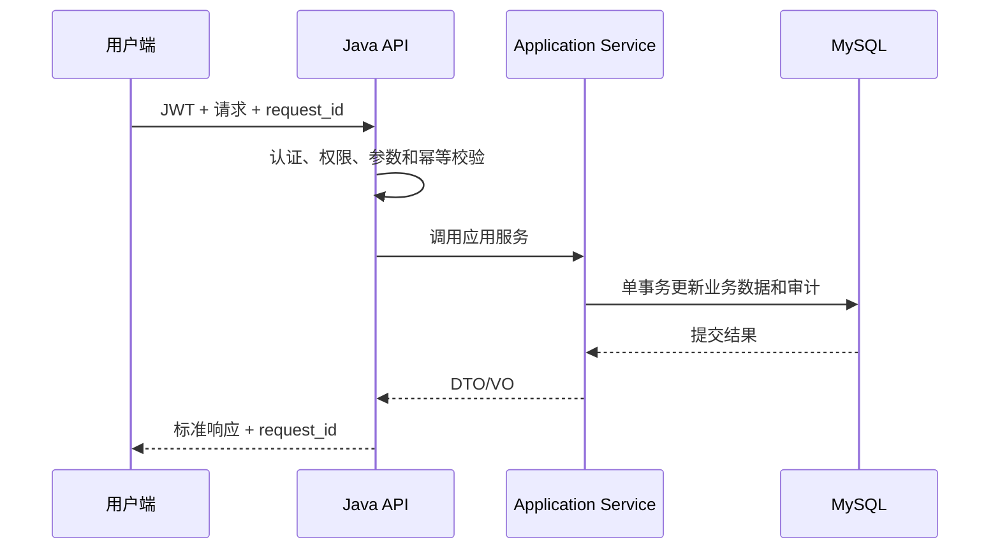
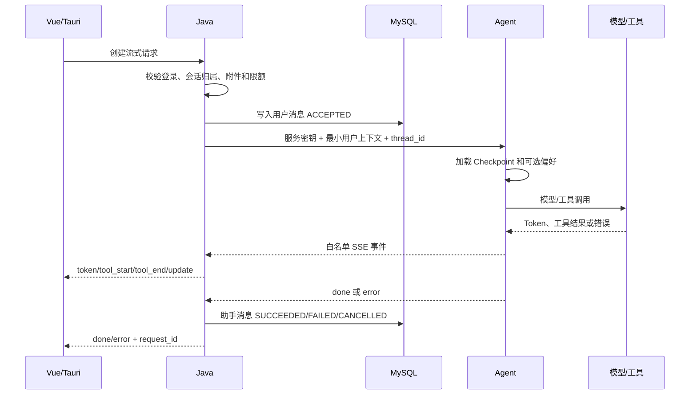
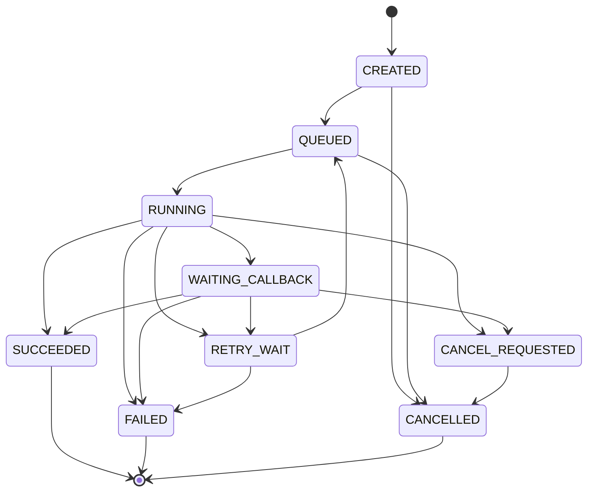

# 灵犀平台架构治理与服务生命周期

> 版本：v1.0  
> 日期：2026-08-08  
> 状态：建议实施  
> 适用范围：`lingXi-vue`、`dkd-parent`、`lingXi-agent` 及其数据库、缓存、对象存储和外部模型供应商

> 事实基线说明：本文的“当前实现”仅以 2026-08-08 工作区源码、Mapper、构建清单和运行配置为依据，不以历史设计稿作为现状依据；“目标状态”均明确标注为待实施方案。

## 1. 文档目的

当前平台采用“Vue 前端 + Java 模块化单体 + Python AI 服务”的混合架构。这个方向适合当前业务规模，主要问题不是服务数量太少，而是模块边界、状态归属、长任务可靠性和交付流程尚未形成统一规则。

本规范解决以下问题：

- `lingXi-manage` 同时承载零售、AI 对话、附件和视频工作流，边界持续扩大；
- Java 与 Agent 之间以同步 HTTP/SSE 为主，长任务容易受请求超时、进程重启和供应商波动影响；
- MySQL 对话记录与 Agent Checkpoint/Memory 同时存在，缺少清晰的数据权威定义；
- 不同功能各自定义任务状态、重试和错误处理，难以统一观测和恢复；
- 当前交付依赖本地脚本，缺少受版本控制的持续集成和标准化部署清单。

目标不是立即改造成全面微服务，而是在保持三个主要部署单元的前提下，形成可演进、可恢复、可观测的生命周期。

## 2. 架构决策

### 2.1 目标部署边界（保留当前三个主要单元）



保留三个主要运行边界：

1. `lingXi-vue`：交互、展示和本地桌面能力，不持有权威业务状态；
2. `dkd-parent/lingXi-admin`：登录、权限、业务事务、审计、任务编排和正式资产元数据；
3. `lingXi-agent`：Prompt、模型选择、LangGraph、工具调用、短期 Checkpoint 和可选长期偏好。

长任务 Worker 初期可以与 Java 同仓库、同版本发布，但必须与 HTTP 请求线程解耦；达到独立扩容条件后再单独部署。

### 2.2 暂不采用全面微服务

只有满足下列任一条件，才评估把某一领域拆成独立服务：

- 需要与 Java 主服务不同的独立扩缩容策略；
- 故障必须与主交易链路隔离；
- 有独立团队和独立发布节奏；
- 数据模型和事务边界已经稳定，跨边界交互可以事件化；
- 单体部署或构建已经成为经过度量的性能瓶颈。

不因“目录变大”或“希望使用微服务”而拆分部署单元。

### 2.3 当前代码实际基线

本节描述已经存在的行为，后续目标状态不得与其混为一谈。

#### 2.3.1 AI 对话

当前调用链为：

```text
Vue → AiController → QwenServiceImpl → AgentClient
    → FastAPI /api/v1/chat/invoke 或 /stream → LangGraph/模型/工具
```

已经实现：

- Java 根据登录态校验会话归属，并构造可信用户、角色和区域上下文；
- `QwenServiceImpl` 在调用 Agent 前保存用户消息；同步回答只有在 Agent 完整成功返回后才保存助手消息；
- 流式回答通过完成回调聚合并保存，使用原子标记防止助手回答重复落库；
- `AgentClient` 为业务工具签发短期访问令牌，并在同步或流式生命周期结束时撤销；
- Agent 使用服务密钥保护非健康检查接口，并限制请求体、并发数、流式时间和输出字符数；
- Agent 支持内存或 PostgreSQL Checkpoint、可选长期偏好存储、心跳、断开取消以及白名单 SSE 事件；
- Java/MySQL 是用户可见会话和消息历史来源，Agent Checkpoint 是推理续接状态。

当前缺口：

- `ModelHistory` 没有统一的 `ACCEPTED/STREAMING/FAILED/CANCELLED` 处理状态；Agent 失败时只能看到用户消息，无法从消息记录准确判断失败阶段；
- 会话删除当前按“删除历史 → 删除会话”顺序执行，但没有事务保护，也没有调用 Agent `/thread` 清理 Checkpoint；
- Java 与 Agent 的 SSE 契约由实现代码约定，尚无独立版本、Schema 或跨服务契约测试作为发布门禁；
- `session_id` 使用时间戳和随机尾数生成，尚未形成统一的不可猜测 ID 规范；
- 服务已有 `request_id` 透传基础，但 Java、Agent、任务和供应商之间还没有完整 Trace 闭环。

#### 2.3.2 章节分析

当前生命周期：

```text
章节：PENDING / NOT_STARTED
  └─ 创建 STORY_BIBLE 任务 QUEUED
       └─ 事务提交后由 aiVideoExecutor 异步领取为 RUNNING
            ├─ PAUSED ──恢复──→ QUEUED
            ├─ SUCCEEDED
            └─ FAILED
```

已经实现：

- 章节原文保存 SHA-256，用 `chapterId + sourceHash` 构造任务幂等键；
- 任务和章节状态在事务内创建，事务提交后才调用异步 Worker，避免与当前事务争抢行锁；
- Worker 通过条件更新将 `QUEUED` 原子领取为 `RUNNING`；
- 运行中按阶段更新进度，暂停后 Worker 在后续检查点停止写入最终结果；
- 成功时在事务中保存故事圣经、角色、场景、镜头和资产，并将章节推进为 `SCRIPT_READY`；
- 删除章节前会锁定并检查活动任务和生成中资产，随后归档关联任务、故事圣经、场景、镜头和资产。

当前限制：

- `aiVideoExecutor` 是进程内线程池（核心 2、最大 4、队列 20），进程在提交后、Worker 开始前退出时缺少通用持久调度恢复；
- `maxRetry` 当前为 0，没有统一自动重试或尝试记录；
- 暂停是协作式暂停，不是立即中断正在执行的远程模型请求；
- 任务状态由字符串分散在 Java 和 XML 中，尚无统一状态枚举与状态机。

#### 2.3.3 图片生成

当前生命周期：

```text
用户确认提示词
  → IMAGE 任务 QUEUED + 资产 GENERATING
  → 定时恢复器原子领取 RUNNING
  ├─ 模型成功 + 文件转存成功 → 任务 SUCCEEDED + 资产已生成
  └─ 模型/存储/状态异常 → 任务 FAILED + 资产失败

FAILED ──用户手动重试──→ QUEUED
```

已经实现：

- 只有 `request_json.trigger = USER_CONFIRMED` 的图片任务可以被领取；
- 定时恢复器串行扫描任务，使用期望状态条件避免重复领取；
- 图片调用统一经过 Python Agent，Java 负责可信业务参数、引用图校验、状态和正式资产落库；
- 完成阶段同时更新任务与资产；供应商或转存失败时记录稳定错误码；
- 可重试供应商错误不会自动再次付费调用，而是转为 `FAILED`，要求用户检查提示词后手动重试；
- 过期的 `RUNNING/RETRYING` 任务会被识别，但当前策略也是失败并等待人工重试。

当前限制：

- 调度依赖同一 Java 进程中的 Spring `@Scheduled`；
- 没有任务租约字段、Worker 标识和独立尝试表；
- `RETRYING` 出现在查询条件中，但当前恢复器不会自动重试模型调用，语义容易误解；
- 没有通用取消流程。

#### 2.3.4 视频生成

当前生命周期：

```text
事务内创建 VIDEO 任务 QUEUED
  → HTTP 请求线程同步调用 Agent/供应商提交
  ├─ 明确提交失败 → FAILED
  ├─ 提交结果不确定 → NEEDS_REVIEW
  └─ 获得 provider_task_id → WAITING_CALLBACK
       → 定时 Poller 原子领取 RUNNING
       ├─ 供应商处理中/查询异常 → WAITING_CALLBACK
       ├─ 成功并转存正式文件 → SUCCEEDED
       └─ 供应商失败/取消 → FAILED
```

说明：`WAITING_CALLBACK` 是当前数据库状态名称，但现有实现实际由定时 Poller 查询供应商，没有发现供应商回调 Controller。

已经实现：

- 提交前创建带幂等键的本地任务；
- 对“供应商可能已受理，但本地未得到可靠结果”的情况进入 `NEEDS_REVIEW`，防止用户重复提交和重复付费；
- 可以人工录入供应商任务 ID 恢复轮询，或确认供应商未受理后结束任务；
- Poller 通过条件更新领取任务，进程中断后会把过期 `RUNNING` 恢复为 `WAITING_CALLBACK`；
- 成功后先下载并转存视频，再在事务中同时完成资产与任务状态。

当前限制：

- 供应商提交仍发生在用户 HTTP 请求线程中，前端快速视频请求超时配置为 120 秒；
- 没有 Outbox、消息队列或独立提交 Worker；本地任务已经提交而进程在调用供应商前退出时，需要人工处理；
- 没有供应商回调验签、事件去重和回调/轮询协同；
- 没有用户取消端点或供应商取消状态闭环；
- `QUEUED → 外部提交 → WAITING_CALLBACK` 跨越数据库事务和远程调用，只能通过 `NEEDS_REVIEW` 补偿不确定性。

#### 2.3.5 当前任务基础设施结论

| 能力 | 当前状态 |
|---|---|
| 权威任务表 | 已有 `ai_video_generation_task` |
| 创建幂等 | 部分已有，按功能构造 `idempotency_key` |
| 原子领取 | 已有，Mapper 使用期望状态条件更新 |
| 进程内异步 | 已有 `aiVideoExecutor` |
| 定时恢复/轮询 | 已有 Spring Scheduler |
| Outbox | 未实现 |
| MQ/Redis Stream | 未实现 |
| 独立 Worker 部署 | 未实现 |
| 统一任务状态机 | 未实现，状态字符串分散 |
| 尝试记录/租约 | 未实现 |
| 供应商回调 | 当前视频链路未实现 |
| 统一取消 | 未实现 |
| 自动重试 | 章节为 0；图片转人工重试；视频持续轮询但无统一重试策略 |

## 3. 问题与解决方案

| 优先级 | 当前问题 | 解决措施 | 完成标志 |
|---|---|---|---|
| P0 | 数据状态归属不明确 | 建立第 4 节的数据权威矩阵 | 每类数据只有一个写入权威 |
| P0 | 章节、图片、视频采用三套不同调度方式，视频提交仍依赖 HTTP 生命周期 | 在现有任务表上补 Outbox 和统一 Worker | 所有长任务先提交后执行，断开页面不影响运行 |
| P0 | 重复请求和回调可能重复执行 | 所有创建、提交和回调使用幂等键 | 相同请求只产生一个业务结果 |
| P0 | 缺少标准 CI | 建立前端、Java、Agent 三条检查流水线 | 合并前自动构建、测试和依赖检查 |
| P1 | `lingXi-manage` 边界过宽 | 按领域拆 Maven 模块或严格包边界 | 依赖方向通过构建或 ArchUnit 校验 |
| P1 | Java/Agent 接口隐式演进 | 版本化 API、SSE 事件和错误码 | 契约测试覆盖正常、超时和断流 |
| P1 | 对话失败缺少完整状态 | 消息增加状态与请求标识 | 可区分失败、取消、处理中和成功 |
| P1 | 观测信息跨服务断裂 | 统一 `request_id`、`trace_id`、`task_id` | 一次请求可跨 Java、Agent、供应商检索 |
| P2 | 部署依赖本地机器状态 | 增加环境清单、健康检查和可重复部署 | 新环境无需手工修改源码即可部署 |

## 4. 数据权威与所有权

任何数据都必须有唯一权威写入方。副本只能用于展示、缓存或恢复，不得与权威方双向竞争更新。

| 数据 | 权威服务 | 权威存储 | 其他服务的权限 | 生命周期 |
|---|---|---|---|---|
| 用户、角色、菜单、登录态 | Java | MySQL / Redis | Agent 只接收最小可信上下文 | 随账号和权限策略管理 |
| 设备、商品、库存、订单、工单 | Java | MySQL | Agent 只通过受控工具查询或提案 | 按业务和审计要求保留 |
| AI 会话元数据 | Java | MySQL | Agent 使用 `session_id/thread_id` | 创建、活跃、归档、删除 |
| 用户与助手消息审计 | Java | MySQL | Agent 不作为长期审计来源 | 按消息状态和保留策略管理 |
| Agent 短期 Checkpoint | Agent | PostgreSQL 或开发内存 | Java 只触发按线程删除 | 会话级，允许重建和过期 |
| 长期回答偏好 | Agent | Agent Store/PostgreSQL | Java 代理用户授权的查看和删除 | 用户级，可撤回、可清除 |
| 生成任务与业务状态 | Java | MySQL | Worker 通过条件更新推进 | 按状态机流转并保留审计 |
| 媒体资产元数据和血缘 | Java | MySQL | Agent 返回临时结果，不直接确权 | 版本化，不覆盖历史 |
| 媒体二进制 | Java/Worker | OSS | 前端使用短期签名 URL | 临时、正式、归档、删除 |
| 模型调用临时上下文 | Agent | 进程或 Checkpoint | 不回写为业务事实 | 随请求或 Checkpoint 过期 |
| 密钥和供应商凭据 | 运维/Java 配置管理 | 环境变量或受保护配置 | 仅最小范围注入 | 创建、轮换、吊销、审计 |

关键原则：

- MySQL 消息记录用于用户可见历史和审计；Agent Checkpoint 用于推理续接，二者不做双主同步；
- 供应商返回的临时 URL 不是正式资产，必须先转存 OSS 并创建资产记录；
- Agent 不能直接修改订单、库存和工单；需要写操作时生成提案，由 Java 鉴权、确认并执行；
- Redis 是缓存和传输设施，不作为必须永久保存的唯一业务数据源。

## 5. 通用生命周期约定

### 5.1 标识符

| 标识 | 生成位置 | 用途 |
|---|---|---|
| `request_id` | 最外层入口；合法上游值可透传 | 一次 HTTP/SSE 请求的日志关联 |
| `trace_id` | 可观测系统 | 跨服务、队列和供应商链路追踪 |
| `session_id` | Java | 用户可见会话及消息归属 |
| `thread_id` | Java 映射，Agent 使用 | Agent Checkpoint 隔离 |
| `message_id` | Java | 单条用户或助手消息 |
| `task_id` | Java | 长任务业务标识 |
| `idempotency_key` | 客户端或 Java | 防止创建和提交重复执行 |
| `provider_task_id` | 外部供应商 | 查询与回调关联，不作为内部主键 |
| `event_id` | 事件生产方 | 回调和消息消费去重 |

所有异步消息必须携带 `trace_id`、`task_id`、`event_id`、事件版本和产生时间，不传递明文密钥。

### 5.2 状态变更规则

- 状态只能通过领域服务或状态机组件更新，Controller、Mapper 和回调入口不得直接拼接状态；
- 更新使用“当前状态 + 版本号”作为条件，防止回调乱序覆盖最终状态；
- 每次状态变更写入操作人、时间、来源、原因和关联请求；
- 终态默认不可逆。需要重做时创建新的尝试或版本，不把旧记录改回运行中；
- 删除优先采用“停止新写入 → 取消任务 → 清理外部状态 → 归档/软删 → 延迟物理删除”。

## 6. 普通业务请求生命周期



规则：

1. Controller 只负责协议、鉴权和校验；
2. Application Service 定义事务边界；
3. Mapper 只负责持久化，不承载权限或跨领域编排；
4. 跨领域更新必须由一个应用服务协调，或通过 Outbox 事件最终一致；
5. 查询可使用缓存，写入成功后必须按策略失效或更新缓存；
6. 返回给前端的错误使用稳定错误码，不暴露堆栈和供应商原始敏感信息。

## 7. AI 对话生命周期

### 7.1 会话状态

```text
ACTIVE → ARCHIVED → DELETING → DELETED
   └──────────────→ DELETING
```

- `ACTIVE`：允许发送消息和继续 Checkpoint；
- `ARCHIVED`：只读，可恢复为 `ACTIVE`；
- `DELETING`：拒绝新消息，取消在途请求并清理 Agent Checkpoint；
- `DELETED`：用户不可见，进入延迟物理清理流程。

### 7.2 消息状态

```text
ACCEPTED → STREAMING → SUCCEEDED
    │          ├────→ FAILED
    │          └────→ CANCELLED
    └───────────────→ REJECTED
```

建议消息表增加或统一以下字段：

- `message_id`、`request_id`、`session_id`、`role`；
- `status`、`error_code`、`started_at`、`completed_at`；
- `content`、`content_hash`、`token_usage`；
- `agent_thread_id`、`model_profile`；
- `parent_message_id` 或重试来源。

### 7.3 流式调用顺序



执行规则：

1. Java 在调用 Agent 前持久化用户消息，保证用户输入可追溯；
2. Agent 只接收由 Java 从登录态生成的用户、角色和区域上下文，不信任前端自报身份；
3. Java 只转发约定白名单内的 SSE 事件，未知事件记录指标但不直接暴露；
4. `done` 后助手消息最多落库一次，使用 `message_id/request_id` 唯一约束；
5. 用户断开连接时取消下游流；若供应商不支持取消，停止转发并记录孤儿调用指标；
6. Agent 超时、限流或失败时，把助手消息标记为 `FAILED`，保留稳定错误码，不伪造成功回答；
7. 用户重试创建新 `message_id`，通过 `parent_message_id` 关联原失败请求；
8. Checkpoint 写入失败不能影响已落库的业务历史，但必须明确降级为无续接模式或终止请求；
9. 删除会话时，Java 先进入 `DELETING`，再调用 Agent 删除 Checkpoint，最后完成业务侧软删除。

### 7.4 SSE 事件契约

建议固定事件集合并按版本演进：

| 事件 | 含义 | 是否可持久化 |
|---|---|---|
| `token` | 可展示文本增量 | 聚合后写助手消息 |
| `tool_start` | 工具开始及脱敏查询范围 | 仅审计摘要 |
| `tool_end` | 工具完成状态和结果数量 | 仅审计摘要 |
| `update` | Agent 节点进度 | 可选短期日志 |
| `approval_required` | 受控写操作等待用户确认 | 必须持久化动作提案 |
| `memory_saved` | 用户偏好已保存 | 保存事件，不复制偏好正文 |
| `heartbeat` | 保活 | 不持久化 |
| `done` | 正常终止 | 推进消息为 `SUCCEEDED` |
| `error` | 异常终止 | 推进消息为 `FAILED` |

新增事件必须保持旧客户端可以忽略；删除或改变语义时升级 API 版本。

## 8. Agent Checkpoint 与长期记忆生命周期

### 8.1 Checkpoint

```text
CREATE → ACTIVE → EXPIRED
             └→ DELETE_REQUESTED → DELETED
```

- 命名空间必须包含可信用户标识与公开会话标识，避免跨用户串线；
- 开发环境允许内存存储，生产环境使用 PostgreSQL；
- Checkpoint 是可丢失的推理状态，不作为用户消息历史的唯一来源；
- 配置保留时间，定期清理长期不活跃线程；
- 用户删除会话或账号时，必须触发对应命名空间清理；
- 清理失败进入重试任务，不阻塞业务侧永久处于 `DELETING`，但需要告警和审计。

### 8.2 长期偏好

长期偏好只保存明确、低风险、枚举化的回答偏好：

1. 用户显式表达或在设置页修改；
2. Agent 校验偏好类型和值；
3. 以用户隔离命名空间写入；
4. 后续请求按最小集合读取；
5. 用户可以查看、修改、关闭和清空；
6. 账号删除时执行级联清理；
7. 不保存密码、身份凭证、原始附件、健康信息等敏感自由文本。

## 9. 长任务生命周期

图片、视频、章节解析、批量导入、质检、渲染等操作不得依赖单次 HTTP 请求持续存活。以下是目标状态机，不代表当前代码已经全部实现。

### 9.1 任务状态机



终态为 `SUCCEEDED`、`FAILED`、`CANCELLED`。人工重试创建新的 `attempt` 或子任务，不把终态记录改回 `RUNNING`。

### 9.2 创建与投递

在一个 MySQL 事务中完成：

1. 校验权限、配额、输入资产版本和 `Idempotency-Key`；
2. 创建业务任务，状态为 `CREATED`；
3. 创建 Outbox 事件；
4. 提交事务；
5. Outbox 发布器将事件投递到任务流；
6. 发布成功后任务进入 `QUEUED`，Outbox 标记已发布。

迁移初期复用现有 MySQL 任务表和 Spring Scheduler，增加 Outbox、租约和统一领取规则；吞吐量或隔离需求达到阈值后再切换 Redis Stream 或 RabbitMQ。无论使用哪种设施，任务表仍是业务状态权威。

### 9.3 Worker 执行

- Worker 以条件更新抢占任务：只有 `QUEUED` 且租约过期的任务可以进入 `RUNNING`；
- 执行期间续租，Worker 崩溃后由其他实例回收超时租约；
- 调用供应商前保存请求摘要、供应商、模型和尝试次数；
- 外部异步任务进入 `WAITING_CALLBACK`，同时保留低频轮询兜底；
- 成功结果先下载和校验，再转存 OSS，最后在一个事务中创建资产并完成任务；
- 推进下游任务使用新的 Outbox 事件，不在当前事务内递归执行整条工作流。

### 9.4 幂等与乱序

- 业务提交：`user_id + operation + idempotency_key` 唯一；
- 供应商提交：为每次尝试保存稳定的外部请求键；
- 回调：`provider + provider_task_id + event_id` 唯一；
- 资产：可按文件哈希和生成任务去重，但不同业务版本不得因哈希相同而丢失血缘；
- 状态更新：使用 `WHERE id = ? AND status IN (...) AND version = ?`；
- 晚到的运行中回调不得覆盖已经成功、失败或取消的终态。

### 9.5 重试、超时和取消

| 错误类型 | 策略 |
|---|---|
| 网络中断、429、供应商 5xx | 指数退避并加入抖动，最多 3 次 |
| 参数、权限、内容安全拒绝 | 不自动重试，直接失败或等待人工处理 |
| 回调丢失 | 轮询供应商状态，超过总时限后失败 |
| Worker 崩溃 | 租约到期后重新入队，同一尝试保持幂等 |
| 用户取消 | 标记 `CANCEL_REQUESTED`，尽力取消供应商任务 |
| 供应商取消不支持 | 忽略晚到产物或标为未认领临时资产，按策略清理 |

每次重试保存独立尝试记录，包含开始时间、结束时间、错误分类和供应商请求标识。

## 10. 模块生命周期与依赖治理

### 10.1 目标模块边界

在不增加部署单元的前提下，逐步形成以下边界：

```text
lingXi-admin            启动、装配和部署入口
lingXi-framework        Web、安全、MyBatis、Redis 等技术适配
lingXi-system           用户、角色、菜单、参数和审计
lingXi-retail           设备、商品、库存、订单、工单等零售领域
lingXi-ai-gateway       会话、消息、附件、Agent 客户端和动作审批
lingXi-media-workflow   小说、图片、视频、资产、任务和供应商适配
lingXi-quartz           调度基础设施
lingXi-generator        代码生成工具
lingXi-common           无业务语义的通用类型和工具
```

新模块初期可以先表现为 `lingXi-manage` 内部的严格包边界，稳定后再迁移为 Maven 模块。

### 10.2 依赖方向

```text
admin → framework/system/retail/ai-gateway/media-workflow/quartz
ai-gateway → system/common
media-workflow → system/common
retail → system/common
framework → system/common
system → common
common → 不依赖任何业务模块
```

禁止事项：

- `common` 出现订单、AI 会话、视频任务等领域实体；
- Controller 跨模块直接注入 Mapper；
- Agent DTO 与数据库实体共用同一个类；
- 领域模块反向依赖 `admin`；
- 通过复制工具类绕过模块依赖规则。

使用 Maven Enforcer 和 ArchUnit 校验模块依赖、包访问和分层规则。

### 10.3 模块变更生命周期

1. 提交 ADR，说明边界、所有者、依赖和数据归属；
2. 定义应用接口及输入输出 DTO；
3. 增加契约和架构测试；
4. 以适配层迁移调用方；
5. 删除旧跨模块调用；
6. 观察一个发布周期后再移动数据库对象或拆部署单元。

## 11. 配置与密钥生命周期

```text
申请 → 审批/创建 → 安全注入 → 运行时读取 → 轮换 → 吊销 → 审计清理
```

规则：

- `.env.example`、YAML 和文档只包含变量名及非敏感默认值；
- 密钥由环境变量、密钥管理系统或受保护的系统配置注入；
- Java 与 Agent 的服务密钥至少支持双密钥轮换窗口，先部署新密钥再吊销旧密钥；
- 日志、异常、SSE 和审计记录中禁止输出密钥、完整 Token 和供应商原始认证头；
- 供应商凭据按用途拆分，Agent 不应获得数据库管理凭据；
- 启动阶段校验必需配置，缺失时就绪检查失败，不能带病对外提供服务；
- 所有安全配置修改记录操作者、时间、来源和脱敏后的配置项名称。

## 12. 发布与部署生命周期

### 12.1 环境

```text
Local → CI → Staging → Production → Observe → Rollback/Complete
```

- Local：允许内存 Checkpoint和本地依赖；
- CI：不调用真实模型，执行离线单元测试、契约测试、构建和依赖检查；
- Staging：使用隔离数据库、对象存储路径和供应商低额度账号；
- Production：使用持久 Checkpoint、正式密钥、备份、告警和容量限制。

### 12.2 合并前检查

前端：

```text
npm ci
npm test
npm run build:prod
```

Java：

```text
mvn -pl lingXi-admin -am test
mvn -pl lingXi-admin -am package
```

Agent：

```text
python -m pip check
python -m pytest -q
python -m compileall app
```

同时执行：

- Java ↔ Agent 请求、响应、错误码与 SSE 契约测试；
- 数据库迁移的前滚和回滚验证；
- 不含密钥和大文件的仓库检查；
- 前后端版本号和 API 兼容性检查。

### 12.3 发布顺序

兼容性发布遵循“先扩展、后切换、再收缩”：

1. 先发布向后兼容的数据库字段和接口；
2. 发布 Agent，使其同时支持旧、新契约；
3. 发布 Java，开始使用新契约；
4. 发布前端，启用新交互；
5. 观察错误率、延迟、队列积压和业务指标；
6. 至少经过一个稳定发布周期，再移除旧字段和旧接口。

不得在同一发布中同时执行不可逆数据库删除和调用方切换。

### 12.4 回滚

- 应用包保持上一稳定版本可立即恢复；
- 数据库变更优先向前修复，破坏性迁移必须提前备份并提供恢复脚本；
- 新事件消费者出现问题时暂停消费，不删除任务和 Outbox；
- Agent 降级时，普通业务继续可用，AI 入口返回明确的暂不可用状态；
- 供应商异常时熔断相关能力，不拖垮 Java 请求线程和数据库连接池。

## 13. 可观测生命周期

### 13.1 日志

结构化日志至少包含：

```text
timestamp, level, service, environment, request_id, trace_id,
user_id_hash, session_id_hash, task_id, event, duration_ms,
status, error_code, provider, model_profile
```

用户 ID、会话 ID 可哈希或仅记录长度；附件正文、Prompt 全文、Token 和密钥不得进入普通日志。

### 13.2 指标

必须建立以下指标：

- Java 和 Agent 请求量、P50/P95/P99 延迟、错误率；
- SSE 活跃连接、完成率、断开率和超时率；
- Agent 模型调用次数、首 Token 延迟、Token 使用和工具失败率；
- 任务各状态数量、队列等待时间、运行时间、重试率和死信数量；
- 供应商成功率、429、5xx、回调延迟和成本；
- MySQL 连接池、慢查询，Redis 命中率，Checkpoint 写入失败；
- Outbox 未发布数量和最老事件年龄。

### 13.3 告警与处置

| 告警 | 处置 |
|---|---|
| Agent 就绪检查失败 | 隔离 AI 流量，保留普通业务服务 |
| Outbox 长时间未发布 | 检查发布器并重放未发布事件 |
| 队列积压持续增长 | 限流新任务、扩容 Worker、检查供应商 |
| 回调验签失败突增 | 拒绝请求并检查密钥、来源和攻击风险 |
| Checkpoint 持久化失败 | 暂停续接能力或降级无状态对话并告警 |
| MySQL 错误率升高 | 停止非关键任务消费，保护交易请求 |

每个高优先级告警应关联 Runbook，记录发现、止损、恢复和复盘过程。

## 14. 实施阶段

### 阶段 0：建立基线（P0）

- 确认本文件中的数据权威矩阵；
- 为 Java ↔ Agent 定义版本化请求、响应、SSE 和错误码契约；
- 统一 `request_id/session_id/task_id/idempotency_key`；
- 建立受版本控制的 CI；
- 补齐当前部署清单和环境变量说明。

验收：三个工程可在干净环境自动构建，核心聊天契约可离线验证。

### 阶段 1：对话生命周期闭环（P0/P1）

- 为消息增加处理状态、请求标识、完成时间和失败码；
- 统一同步和流式回答的落库规则；
- 完成断流、超时、取消、重试和会话删除测试；
- 明确 MySQL 历史与 Agent Checkpoint 的清理策略；
- 建立跨 Java/Agent 的链路指标。

验收：任一对话都能回答“是否完成、为何失败、能否重试、Checkpoint 是否已清理”。

### 阶段 2：长任务可靠化（P0/P1）

- 建立统一任务表、尝试记录和 Outbox；
- 将图片、视频、章节分析等长任务移出 HTTP 请求线程；
- 实现 Worker 租约、重试、回调幂等、结果转存和取消；
- 通过 SSE 或轮询向前端展示服务端权威状态。

验收：关闭浏览器、重启 Worker、重复回调和网络超时都不会丢任务或生成重复资产。

### 阶段 3：模块边界治理（P1）

- 先在 `lingXi-manage` 内形成零售、AI Gateway、媒体工作流包边界；
- 增加 ArchUnit 和 Maven 依赖规则；
- 把跨边界调用改为应用接口和专用 DTO；
- 边界稳定后再拆为 Maven 模块，不改变部署拓扑。

验收：构建能够阻止 Controller→Mapper 跨模块、业务模块反向依赖和领域对象进入 `common`。

### 阶段 4：标准化交付（P1/P2）

- 建立 Staging 和 Production 配置模板；
- 补齐可重复部署、健康检查、备份、监控、告警和 Runbook；
- 演练 Agent 不可用、供应商限流、队列积压和数据库恢复；
- 根据实际容量数据决定是否独立扩容 Worker 或拆服务。

验收：新版本能够逐步发布、观测并在不丢业务状态的前提下回滚。

## 15. 总体验收标准

完成本轮治理后，系统应满足：

1. 每类业务数据都能明确唯一权威服务和存储；
2. 普通业务在 Agent 故障时仍然可用；
3. 对话请求断流、超时或失败后具有明确状态并可安全重试；
4. 用户删除会话后，MySQL 历史、Agent Checkpoint 和长期偏好按策略清理；
5. 所有长任务离开页面后继续执行，进程重启后能够恢复；
6. 重复提交、重复消息和重复回调不会产生重复业务结果；
7. 任一任务可以从用户请求追踪到 Java、Agent、Worker、供应商和正式资产；
8. 供应商临时文件不会被当作长期正式资产；
9. 三个工程在合并前通过自动测试和构建；
10. 发布具备兼容顺序、监控窗口和经过演练的回滚方案。

## 16. 相关文档

- [平台总览](../README.md)
- [AI Agent 开发与接口说明](../lingXi-agent/README.md)
- [Java AI 对话编排实现](../dkd-parent/lingXi-manage/src/main/java/com/lingXi/ai/service/impl/QwenServiceImpl.java)
- [Java Agent 客户端](../dkd-parent/lingXi-manage/src/main/java/com/lingXi/ai/client/AgentClient.java)
- [会话生命周期当前实现](../dkd-parent/lingXi-manage/src/main/java/com/lingXi/ai/service/impl/ChatSessionServiceImpl.java)
- [Agent 应用生命周期](../lingXi-agent/app/main.py)
- [Agent 对话与 SSE 生命周期](../lingXi-agent/app/api/v1/chat.py)
- [章节分析任务创建](../dkd-parent/lingXi-manage/src/main/java/com/lingXi/aiVedio/service/impl/AiVideoChapterServiceImpl.java)
- [视频任务轮询](../dkd-parent/lingXi-manage/src/main/java/com/lingXi/aiVedio/worker/AiVideoProviderTaskPoller.java)
- [图片任务恢复](../dkd-parent/lingXi-manage/src/main/java/com/lingXi/aiVedio/worker/AiVideoQueuedImageTaskRecovery.java)
- [任务状态条件更新](../dkd-parent/lingXi-manage/src/main/resources/mapper/aiVedio/AiVideoGenerationTaskMapper.xml)
